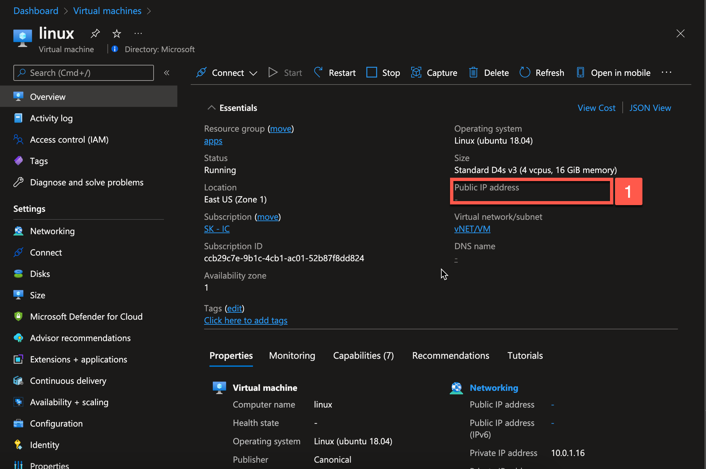
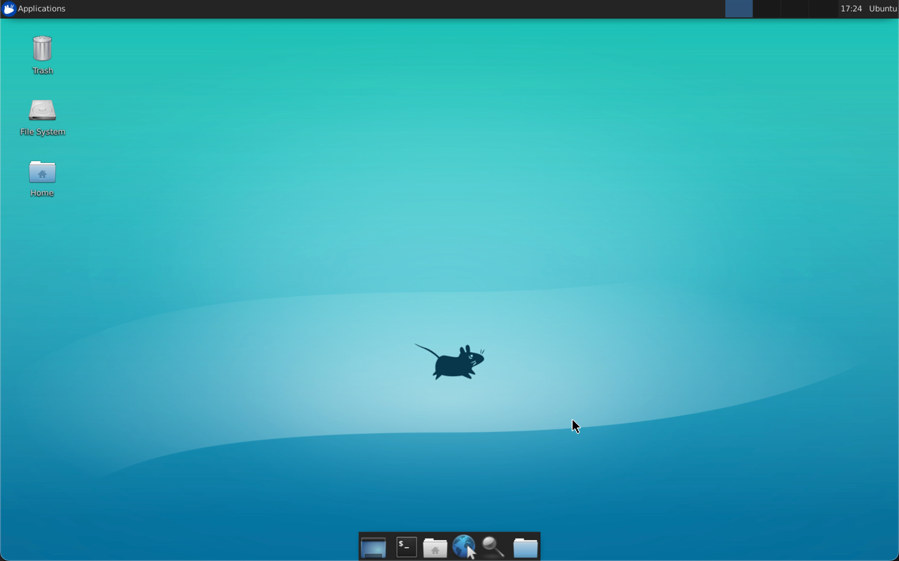

## Template to Create a Linux VM , install Docker and pull a Docker image

## Prerequisites 

* Azure Subscription
* Enough vCPU quota to provision one of the below SKU
  *       "Standard_D2s_v3",
          "Standard_NC8as_T4_v3",
          "Standard_NV12s_v3",
          "Standard_NC64as_T4_v3",
          "Standard_NV48s_v3"

If you would like to increase your quota limit,  please follow [this](https://docs.microsoft.com/en-us/azure/azure-portal/supportability/per-vm-quota-requests) guide. 


## Deploy to Azure 


[](https://portal.azure.com/#create/Microsoft.Template/uri/https%3A%2F%2Fraw.githubusercontent.com%2Fkrishnaji%2Flinux-vm-with-docker%2Fmain%2Fazuredeploy.json)


1. Select the resource group
2. Fill in the Admin username
3. Select Vm Size from the dropdown
4. Select Authetication type
   1. Password - fill in the Admin password
   2. SSH Public Key  - Use existing public key and paste you public key
5. Fill in the docker image name that you like to be pulled once the vm is provisioned 
6. Review and Create
   
## Login to new VM
1. Once the VM is provisoned get the public up for the vm 
   
2. ssh into the vm
   ```bash
    ssh <admin-username>@<vm-public-ip> 
    ```

## Install XRDP
1. Install xfce desktop environment
   ```bash 
    sudo apt-get update
    sudo DEBIAN_FRONTEND=noninteractive apt-get -y install xfce4
    sudo apt install xfce4-session
    sudo apt-get -y install xrdp
    sudo systemctl enable xrdp
    echo xfce4-session >~/.xsession
    sudo service xrdp restart
    ```
2.  Create Network Security Group for Remote Desktop Traffic using [Azure CLI](http://shell.azure.com/)
    ```bash 
    az vm open-port --resource-group myResourceGroup --name myVM --port 3389
    ```
3. Connect your Linux VM with a Remote Desktop client

    

